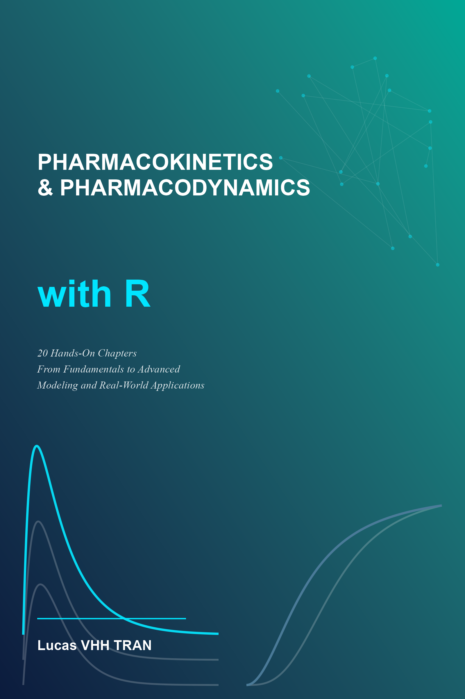

::: {.book-cover}
{alt="Book cover: Master Pharmacokinetics and Pharmacodynamics (PKPD) with R"}
:::

Welcome to *Master Pharmacokinetics and Pharmacodynamics (PKPD) with R* — a comprehensive, hands-on guide to understanding and modeling drug behavior using the R programming language. This book takes you from the fundamental concepts of how drugs move through and affect the body, all the way to advanced population modeling, Bayesian PK/PD, and physiologically based pharmacokinetics.

## About This Book

Pharmacokinetics (what the body does to the drug) and pharmacodynamics (what the drug does to the body) form the scientific foundation of drug development and clinical therapeutics. Modern pharmacometrics — the science of quantitative pharmacology — relies heavily on computational modeling to integrate PK and PD data, predict drug behavior, optimize dosing, and support regulatory decisions.

R has become one of the most widely used platforms for PK/PD data analysis and modeling. With a rich ecosystem of specialized packages for noncompartmental analysis, compartmental modeling, population PK, and simulation, R provides a complete, reproducible, and accessible workflow.

This book bridges the gap between PK/PD theory and practical implementation. Every chapter combines pharmacological concepts with executable R code, real or simulated datasets, and interpretive guidance. You learn by doing — writing scripts, fitting models, visualizing results, and solving problems.

## Who This Book Is For

This book is designed for:

- **Graduate students** in pharmacology, pharmaceutical sciences, or related fields who want to learn PK/PD modeling
- **Clinical pharmacologists** and **pharmacometricians** seeking a practical R-based workflow
- **Pharmaceutical scientists** involved in drug development and translational research
- **Regulatory scientists** who need to understand and evaluate PK/PD analyses
- **Data scientists** transitioning into the pharmaceutical domain
- **Anyone** interested in quantitative pharmacology and model-informed drug development

## Prerequisites

Readers should have:

- Basic familiarity with R programming (data frames, basic plotting, functions)
- Some exposure to calculus concepts (derivatives, integrals — we review what you need)
- Introductory biology and physiology knowledge
- No prior PK/PD or pharmacometrics experience is required — we start from first principles

## What You'll Learn

By the end of this book, you will be able to:

- Understand the core concepts of pharmacokinetics and pharmacodynamics
- Perform noncompartmental analysis (NCA) and interpret PK parameters
- Build, simulate, and fit one- and multi-compartment PK models in R
- Model pharmacodynamic dose-response relationships (Emax, sigmoid Emax)
- Link PK and PD using effect compartment and indirect response models
- Handle nonlinear and saturable pharmacokinetics (Michaelis–Menten)
- Conduct population PK analysis with mixed-effects models
- Diagnose and validate PK/PD models with goodness-of-fit plots and VPCs
- Simulate dosing regimens and compute probability of target attainment
- Analyze exposure-response relationships for efficacy and safety
- Apply physiologically based pharmacokinetic (PBPK) modeling concepts
- Use Bayesian methods for PK/PD parameter estimation
- Perform sensitivity analysis to triage parameters and guide model simplification
- Build reproducible, regulatory-ready reports with Quarto

## Book Structure

The book is organized into five thematic parts following the natural learning arc of PK/PD:

- **Part I — Foundations (Chapters 1–4):** What PK/PD is, core biology and drug action concepts, essential mathematics, and setting up your R environment for PK/PD work.

- **Part II — Classical Pharmacokinetic Analysis (Chapters 5–8):** Noncompartmental analysis, one-compartment models, multi-compartment models, and understanding absorption and bioavailability across routes of administration.

- **Part III — Pharmacodynamics and PK/PD Linkage (Chapters 9–11):** Dose-response modeling, linking concentration to effect through PK/PD models, and handling nonlinear and saturable pharmacokinetics.

- **Part IV — Population Modeling and Clinical Application (Chapters 12–16):** Population PK with mixed effects, model diagnostics and validation, simulation and dose optimization, exposure-response analysis, and special populations.

- **Part V — Advanced Topics and Applied Practice (Chapters 17–21):** PBPK modeling, Bayesian PK/PD, comprehensive case studies, best practices for reporting and reproducibility, and sensitivity analysis.

## Core Mental Models

Before diving into the chapters, here are eight recurring patterns that unify PK/PD modeling. Keep these in mind as you read — they are the "big picture" that connects seemingly disparate topics.

1. **The Compartmental Ladder** (Ch 5–8, 17): Drug disposition is modeled as ODEs over compartments — from one-compartment $C(t) = (Dose/V)e^{-k_e t}$ to PBPK with organ-level blood flows. Every model in this book reuses this ODE substrate.

2. **Parameters Become State-Dependent** (Ch 11, 16): The recurring "upgrade" is taking a fixed parameter (CL) and making it a function of system state — Michaelis-Menten (CL depends on C), enzyme induction (CL depends on $E(t)$), or DDI (CL depends on a second drug). Each upgrade switches from analytical to numerical (deSolve) solutions.

3. **Stacked Hill Equations** (Ch 9–10): PK drives PD via $C(t) \rightarrow$ effect through Emax/Hill: $E = E_{max}C^n/(EC_{50}^n + C^n)$. When effect lags, insert an effect compartment. The whole chain derives from receptor occupancy $\theta = [L]/(K_d + [L])$.

4. **Coupling State Variables** (Ch 10, 16): Once you have $C(t)$ and $E(t)$ as ODE states, couple in disease progression $D(t)$, enzyme level, or a second drug. The pattern is always the same — each new derivative = function of existing states, solved with one `ode()` call. The cost: parameter count — identifiability is the central risk.

5. **Population Variability = Fixed × Random** (Ch 12): $\theta_i = \theta_{pop} \cdot e^{\eta_i}$, $\eta_i \sim N(0,\omega^2)$. Covariates explain part of $\eta_i$ via allometric scaling ($\beta \approx 0.75$ for CL, $\approx 1.0$ for V).

6. **The Estimation Ladder** (Ch 13, 18): OLS (linearize) → WLS (handle heteroscedasticity) → NLS (fit directly, Levenberg-Marquardt) → MLE (get $\sigma$ + asymptotics) → Bayesian (priors + full posterior). Each rung costs more computation but reduces bias or adds information.

7. **Sensitivity Analysis Brackets Every Model** (Ch 21): Local sensitivity ($S_p$, "a flashlight") is fast. Global sensitivity (Sobol/PRCC, "daylight") surveys the full parameter space. Run sensitivity *before* estimation to triage which parameters to fit vs fix.

8. **IVIVE/PBPK as Integration** (Ch 17): $CL_{int} = V_{max}/K_m \rightarrow$ well-stirred model $\rightarrow$ flow-limited vs capacity-limited regime check $\rightarrow$ feed into PBPK ODEs. Know your regime — it determines which errors matter.

---

## How to Use This Book

Each chapter follows a consistent format designed for self-study:

1. **Learning Objectives** — What you will master by the end of the chapter
2. **Core Theory** — The essential pharmacological and mathematical concepts, explained intuitively
3. **R Code Examples** — Executable code that you can run, modify, and learn from
4. **Worked Examples** — Real or simulated data analyzed step by step
5. **Interpretation Notes** — How to read results and avoid common misinterpretations
6. **Exercises** — Practice problems with answers
7. **Common Mistakes** — Pitfalls and how to avoid them

A **recommended self-study path** is:

1. Chapters 1–4: Foundations and R setup
2. Chapters 5–10: Classical PK/PD analysis
3. Chapters 11–15: Modeling, variability, and prediction
4. Chapters 16–21: Real-world complexity, advanced practice, and sensitivity analysis

## Acknowledgments

This book draws on the rich tradition of pharmacokinetics and pharmacodynamics research, from the pioneering work of Gerhard Levy and Lewis Sheiner to the modern pharmacometrics community. The R PK/PD package ecosystem — particularly the contributions of the `PK`, `nlme`, `mrgsolve`, and `nlmixr2` communities — has made reproducible PK/PD analysis accessible to all.

## Colophon

This book was written using Quarto and R. All code is executable, and the entire book can be rendered from source. The source code is available on GitHub.

